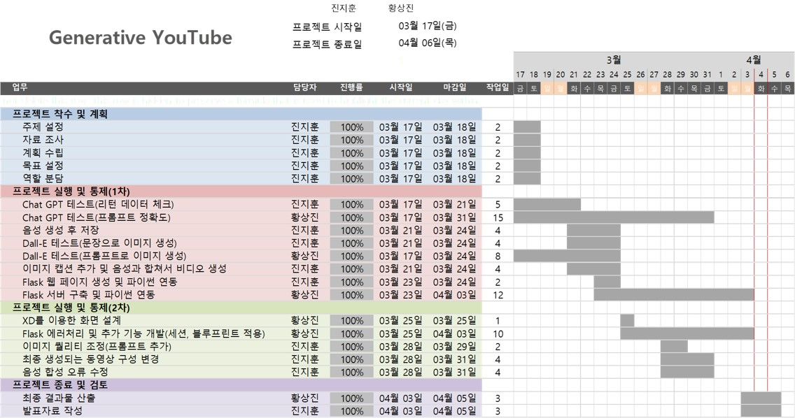

# ai_project_final
## 주제
- Generative AI를 활용하여 누구나 손쉽게 유튜브용 영상 만들기(Generative Youtube)

## WBS
- 

## 개발 기획서
- [Generative Youtube 기획](https://equal-cardamom-6cb.notion.site/Generative-Youtube-36c7581929894d3a88e96c40c2d1a60b)


## Flask 관련
```bash
conda activate final
export FLASK_APP='main' 
flask run
```

## 포트폴리오
- [다운로드](/portfolio/Generative%20Youtube.pdf)
- [시연영상](https://youtu.be/euQoqmpvnMs)